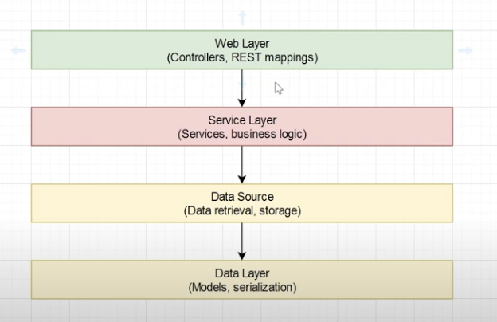

# Notes

This is were I put my notes if I find something interesting in documentation or while experimenting.

## Kotlin - Syntax

- When prefixing an argument with * you are using the spread operator. Example in the `main()` function: `*args`.

## Run requests locally directly in IntelliJ IDEA

You can create a `requests.http` file (there's an example file of this in the project) and add the requests you want to run.
You get a green "Run" icon next to them.

I followed the [instructions here](https://kotlinlang.org/docs/jvm-spring-boot-add-db-support.html#add-messages-to-database-via-http-request).

## Learn more about Kotlin 📚

The tutorial ended with a link to a [PDF that can be used for a personal development map when learning Kotlin](https://resources.jetbrains.com/storage/products/kotlin/docs/Kotlin_Language_Features_Map.pdf).

## Automated testing 🧪

I will look into this tutorial: https://kotlinlang.org/docs/jvm-test-using-junit.html
I've also looked at this Youtube playlist: https://www.youtube.com/playlist?list=PL6gx4Cwl9DGDPsneZWaOFg0H2wsundyGr

The structure of the API based on the Youtube playlist:

## Mocking libraries 🙌
- Tested https://mockk.io/ & built-in mockMvc
- Testing https://wiremock.org/docs/ for stubbing external requests (but it is not so easy to get working as the others)

## Issues 🚨
1. There's a lack of good documentation for configuring Wiremock with Kotlin + Spring Boot (and JUnit 5). I've gone through several community-made articles/guides to try and find a good solution, but have failed so far. 
   Some of the resources I've checked:
    - https://www.turtlestoffel.com/topics/programming/kotlin/functional-testing
    - https://medium.com/cuddle-ai/testing-spring-boot-application-using-wiremock-and-junit-5-d514a47ab931
    - https://www.schibsted.pl/blog/integration-testing-deep-dive-part-i/ (This one helped me solve it finally. 🙏)
2. Getting Swagger UI generation to work took some digging. Articles that I found were not updated to latest versions of springdoc etc.
   These resources helped me in solving it:
   - https://github.com/springdoc/springdoc-openapi-gradle-plugin/issues/121
   - https://springdoc.org/#migrating-from-springdoc-v1
   - https://springdoc.org/#gradle-plugin

## Highlights
1. I like how much "Java boilerplate" that Kotlin seems to have removed. Defining classes and functions is a joy and feels more similar to what I'm used to in the Javascript world. 😊
2. It was easy to get started with the basics just by just following Kotlin's own docs. 

## Ideas after exploring this
I really want to the same thing with some other languages & frameworks, just to get a feel for how they are to work with. 
It will just give me an initial impression/feeling, but I believe that it might benefit my work in the future. I've worked with Java + Spring Boot & Node.js + Express professionally so I'll not include them in this exploration.

I aim to try the following:
- [ ] Go + Gin 
  - Tutorial: https://go.dev/doc/tutorial/web-service-gin
  - Testing resources: 
    - https://gin-gonic.com/docs/testing/
    - https://apitest.dev/
- [ ] Rust + Axum (+ Tokio & Serde)
  - Tutorial: https://www.twilio.com/en-us/blog/build-high-performance-rest-apis-rust-axum
  - Testing resources:
    - https://docs.rs/axum-test/latest/axum_test/
    - https://github.com/alexliesenfeld/httpmock
- [ ] C# + .NET Core
  - Tutorial: https://learn.microsoft.com/en-us/aspnet/core/tutorials/first-web-api?view=aspnetcore-8.0&tabs=visual-studio
  - Testing resources:
    - https://learn.microsoft.com/en-us/aspnet/core/test/integration-tests?view=aspnetcore-8.0